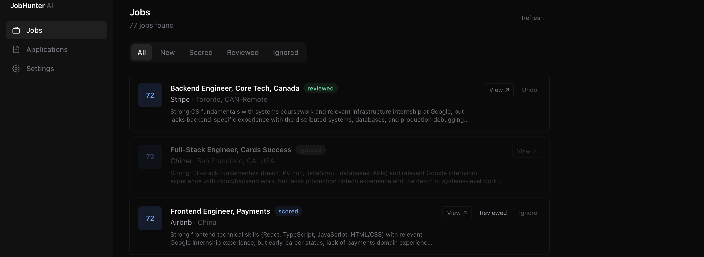

# JobHunter AI

A fully autonomous multi-agent system that scrapes, scores, and applies to software engineering jobs — with a human-in-the-loop approval gate before anything gets submitted.

Built for the modern SWE job hunt, where applying to 100+ roles is the norm and manually sorting through job boards is a waste of time.

---

## What It Does

1. **Scrapes** job listings from Greenhouse and Lever boards across 30+ top tech companies
2. **Filters** to SWE-relevant roles only (backend, frontend, ML, data, mobile, etc.) — no sales engineers, no AV engineers
3. **Scores** each job against your resume using Claude AI — rates skill overlap, project relevance, and domain fit on a 0–100 scale
4. **Surfaces** the best matches in a React dashboard where you can review, filter by status, and expand cards for full details
5. **Applies** automatically via Playwright — fills Greenhouse application forms, captures screenshots, and records submissions
6. **Orchestrates** the full pipeline with a real AI agent (Claude tool-use) — scrape → score → review → apply, with a human approval gate before any applications go out

---

## Dashboard



> Jobs ordered by match score. Color-coded badges: green (85+), blue (70+), yellow (55+), orange (40+), red (<40). Claude's one-sentence reasoning shown under each title. Click any card to expand full reasoning, metadata, and source URL.

---

## Architecture

```
┌─────────────────────────────────────────────────────────────┐
│                       React Dashboard                        │
│   Jobs · Settings · Orchestrator   (Vite + Tailwind :5173)  │
└────────────────────────┬────────────────────────────────────┘
                         │ HTTP (REST)
┌────────────────────────▼────────────────────────────────────┐
│                      FastAPI Backend                          │
│   /api/v1/jobs   /profile   /pipeline   /orchestrator        │
└──────┬──────────────────┬──────────────────┬────────────────┘
       │                  │                  │
┌──────▼──────┐  ┌────────▼────────┐  ┌─────▼──────────────────┐
│   Scraper   │  │  Resume Match   │  │     Orchestrator         │
│   Agent     │  │     Agent       │  │     Agent (Claude)       │
│             │  │                 │  │                          │
│ Greenhouse  │  │  Resume PDF     │  │  Real AI agent loop      │
│ Lever APIs  │  │  Claude Haiku   │  │  6 tools: scrape, score, │
│ Title filter│  │  Score + reason │  │  review, approve, apply  │
│ Per-co cap  │  │                 │  │  Human approval gate     │
└──────┬──────┘  └────────┬────────┘  └─────┬──────────────────┘
       │                  │                  │
       └──────────────────┼──────────────────┘
                          │
              ┌───────────▼──────────────┐
              │        PostgreSQL         │
              │  jobs · applications ·   │
              │  user_profiles ·         │
              │  orchestrator_sessions   │
              └───────────┬──────────────┘
                          │
              ┌───────────▼──────────────┐
              │   Apply Agent            │
              │   (Playwright)           │
              │   Fills forms            │
              │   Screenshots            │
              │   Records submissions    │
              └──────────────────────────┘
```

### Agents

| Agent | File | Status | Responsibility |
|---|---|---|---|
| Scraper | `agents/scraper.py` | ✅ Live | Fetches listings from Greenhouse + Lever, deduplicates, stores in DB |
| Resume Match | `agents/resume_match.py` | ✅ Live | Scores jobs against your resume via Claude Haiku |
| Apply | `agents/apply.py` | ✅ Live | Auto-fills Greenhouse forms via Playwright, captures screenshots |
| Orchestrator | `agents/orchestrator.py` | ✅ Live | Real Claude tool-use agent — runs the full pipeline end-to-end with a human approval gate |
| Outreach | `agents/outreach.py` | Planned | Finds referral contacts, drafts emails |

---

## The Orchestrator

The Orchestrator is a real AI agent built on Claude's tool-use API. Give it a goal in plain English and it figures out what to do:

```
Goal: "Find me backend engineering jobs at fintech companies and apply to the best ones"
```

It then:
1. Checks the current DB state (how many jobs, what's already scored/reviewed)
2. Decides which path to take — scrape fresh, score existing, or work with reviewed jobs
3. Auto-reviews the top matches (up to your `max_apply` cap)
4. **Pauses and shows you the job list for approval** before anything gets submitted
5. After you approve, runs the Apply Agent on the selected jobs

**Modes:**
- `Fresh Scan` — full pipeline: scrape → score → auto-review → approve → apply
- `Use Reviewed` — skip scrape/score, work with jobs you've already manually reviewed

**Options:**
- `Handoff mode` — fills the form in a visible browser, then pauses so you can review and submit manually
- `Dry run` — runs the full loop with mock data, never touches real job boards
- `max_apply` — cap on how many jobs get sent to the approval gate (1–10)

---

## Tech Stack

**Backend**
- Python 3.11+, FastAPI, SQLAlchemy (async), Alembic
- PostgreSQL + Redis (Docker)
- Anthropic Claude API — `claude-haiku-4-5-20251001` for scoring, `claude-sonnet-4-6` for orchestration
- Playwright (browser automation for Apply Agent)
- httpx (async HTTP), pdfminer.six (PDF parsing)
- Celery (hourly scheduled scrape + score runs)

**Frontend**
- React 18, Vite, Tailwind CSS

**Infrastructure**
- Docker Compose (local Postgres + Redis)
- Pydantic Settings (type-safe config from `.env`)

---

## Scoring Logic

The Resume Match agent sends each job + your resume to Claude with a calibrated prompt:

- **Ignores years-of-experience requirements** — "5+ years required" is a wish list, not a hard gate for early-career candidates
- **Scores on skill overlap** — if you have 60%+ of the listed tech skills, score ≥ 65; 80%+ → score ≥ 80
- **Scores "worth applying?" not "will you get hired?"** — optimistic by design

Score guide:
```
85–100  Excellent match — strong skill overlap, clearly relevant background
70–84   Good match — most skills present, apply confidently
55–69   Decent match — some gaps but enough overlap to apply
40–54   Weak match — missing several core requirements
0–39    Poor match — different domain or skill set
```

---

## Setup

### Prerequisites
- Docker Desktop (for Postgres + Redis)
- Python 3.11+
- Node.js 18+
- An [Anthropic API key](https://console.anthropic.com)

### 1. Clone and configure

```bash
git clone https://github.com/your-username/job-agent.git
cd job-agent
cp .env.example .env
```

Edit `.env` and add your Anthropic API key:
```
ANTHROPIC_API_KEY=sk-ant-...
```

### 2. Start infrastructure

```bash
docker-compose up -d
```

This starts PostgreSQL (port 5432) and Redis (port 6379).

### 3. Backend

```bash
cd backend
pip install -r requirements.txt
alembic upgrade head          # create DB tables
uvicorn api.main:app --reload --port 8000
```

### 4. Frontend

```bash
cd frontend
npm install
npm run dev                   # starts at localhost:5173
```

### 5. Add your profile

Place your resume PDF somewhere accessible and set the path in Settings (`localhost:5173`). Fill in your name, email, phone, LinkedIn, and GitHub — the Apply Agent uses these to fill forms.

---

## Running the Agents

### Option A — Orchestrator (recommended)

Open `localhost:5173`, go to the **Orchestrator** tab, type a goal, and hit Start. The agent handles the rest and pauses for your approval before applying.

### Option B — Manual pipeline

```bash
cd backend

# 1. Scrape jobs
python -m agents.scraper --dry-run    # preview without saving
python -m agents.scraper              # full run

# 2. Score against your resume (absolute path required)
python -m agents.resume_match --resume /absolute/path/to/data/resumes/YourResume.pdf

# 3. Review jobs in the dashboard, mark the ones you want to apply to

# 4. Apply
python -m agents.apply --dry-run      # fill forms + screenshot, never submit
python -m agents.apply                # real submissions
python -m agents.apply --job-ids <uuid1> <uuid2>   # target specific jobs
```

### Celery (optional — for scheduled hourly runs)

```bash
celery -A workers.celery_app worker --loglevel=info        # Terminal 1
celery -A workers.celery_app beat --loglevel=info -S workers.schedule  # Terminal 2
```

The "Run Now" button in the dashboard doesn't require Celery — it uses FastAPI BackgroundTasks.

---

## Configuration

All settings live in `.env`. Key options:

| Variable | Default | Description |
|---|---|---|
| `ANTHROPIC_API_KEY` | — | Required for scoring and orchestration |
| `SCRAPER_MAX_JOBS_PER_RUN` | `50` | Total SWE jobs to keep per scrape run |
| `SCRAPER_MAX_JOBS_PER_COMPANY` | `5` | Per-company cap (ensures diversity) |
| `APPLY_MIN_SCORE` | `70` | Minimum match score before auto-applying |
| `APPLY_HEADLESS` | `true` | Set to `false` to watch the browser fill forms |
| `APPLY_DRY_RUN` | `false` | Fill + screenshot but never click submit |
| `APPLY_HANDOFF` | `false` | Pause after filling so you can submit manually |
| `ORCHESTRATOR_MODEL` | `claude-sonnet-4-6` | Claude model for the agent loop |
| `ORCHESTRATOR_MAX_TURNS` | `10` | Max tool-call turns before the agent stops |
| `ORCHESTRATOR_DRY_RUN` | `false` | Use mock data for safe end-to-end testing |

To target different companies, override `GREENHOUSE_SLUGS` or `LEVER_SLUGS` in `.env` as JSON:
```
GREENHOUSE_SLUGS={"stripe": "Stripe", "figma": "Figma", "notion": "Notion"}
```

Find a company's slug at `https://boards.greenhouse.io/{slug}` or `https://jobs.lever.co/{slug}`.

---

## Project Structure

```
job-agent/
├── backend/
│   ├── agents/
│   │   ├── scraper.py              # Greenhouse + Lever scraper
│   │   ├── scraper_parsers.py      # Pure parsing + filter logic
│   │   ├── resume_match.py         # Resume scoring orchestration
│   │   ├── resume_match_logic.py   # Pure scoring functions (prompt, parse, clamp)
│   │   ├── apply.py                # Playwright form-filler orchestration
│   │   ├── apply_logic.py          # Pure apply functions (name split, screenshots)
│   │   ├── orchestrator.py         # AI agent loop (tool-use, approval gate)
│   │   └── orchestrator_logic.py   # Pure functions: tool defs, prompt, response parsing
│   ├── api/
│   │   ├── main.py                 # FastAPI app, CORS, routers
│   │   └── routes/
│   │       ├── jobs.py             # GET /jobs, PATCH /jobs/{id}, DELETE /jobs
│   │       ├── profile.py          # GET /profile, PUT /profile
│   │       ├── pipeline.py         # POST /pipeline/run, GET /pipeline/status
│   │       └── orchestrator.py     # POST /run, GET /status/{id}, POST /approve/{id}, GET /history
│   ├── workers/
│   │   ├── celery_app.py           # Celery app instance + config
│   │   ├── tasks.py                # scrape_task, score_task, scrape_and_score_task
│   │   └── schedule.py             # Celery Beat hourly schedule
│   ├── core/
│   │   ├── config.py               # Pydantic Settings (reads .env)
│   │   ├── database.py             # Async SQLAlchemy engine + session
│   │   └── logging_config.py       # JSON structured logging
│   ├── models/
│   │   ├── job.py                  # Job (title, company, score, status)
│   │   ├── application.py          # Application (job_id, status, screenshot)
│   │   ├── user_profile.py         # Resume path, personal info for Apply Agent
│   │   └── orchestrator_session.py # Orchestrator session (goal, steps, status)
│   ├── services/
│   │   └── resume_parser.py        # PDF → text, HTML stripping
│   ├── tests/
│   │   ├── unit/                   # Pure function tests (no DB, no network)
│   │   └── integration/            # API + DB tests (test database)
│   └── requirements.txt
├── frontend/
│   └── src/
│       ├── pages/
│       │   ├── JobsPage.jsx        # Main dashboard (filters, expandable cards, Run Now)
│       │   ├── SettingsPage.jsx    # User profile form
│       │   └── OrchestratorPage.jsx # Agent UI (goal input, reasoning log, approval panel)
│       └── api/client.js           # HTTP client for all FastAPI endpoints
├── data/
│   └── resumes/                    # Resume PDFs (gitignored)
├── docker-compose.yml
└── .env.example
```

---

## Tests

```bash
cd backend
pytest tests/ -v
pytest tests/ --cov=. --cov-report=term-missing
```

281 tests across unit + integration. Coverage targets: agents 90%+, API routes 100%.

---

## Roadmap

- [x] Phase 1 — Foundation (FastAPI, SQLAlchemy, Docker, Alembic)
- [x] Phase 2 — Scraper Agent (Greenhouse + Lever, keyword filtering, per-company diversity)
- [x] Phase 2 — Resume Match Agent (Claude scoring, PDF parsing, React dashboard)
- [x] Phase 3A — User Profile API + Settings UI
- [x] Phase 3B — Celery scheduling + Run Now button
- [x] Phase 3C — Apply Agent (Playwright form-fill, screenshots, dry run mode)
- [x] Phase 4 — Orchestrator (Claude tool-use agent, human-in-the-loop approval gate, session history)
- [ ] Phase 5 — Smarter Apply Agent (DOM → Claude → execute for arbitrary form fields, EEOC fields, multi-page forms)
- [ ] Phase 6 — Outreach Agent (LinkedIn contact finder, referral email drafter)

---

## Why This Exists

The SWE job market requires volume. Sending 5 carefully-crafted applications used to work. Now you need to send 50–100+, which means spending hours manually sorting through job boards, copy-pasting descriptions, and deciding what's worth applying to.

This system automates the sorting and applying steps — the parts that don't require human judgment — so you can spend your time on the applications that actually matter.
